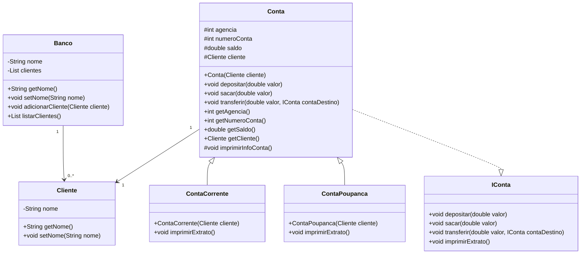

# Sistema Bancário

Este projeto é um exemplo de um sistema bancário simples implementado em Java. Ele demonstra conceitos de orientação a objetos, incluindo herança, encapsulamento e polimorfismo.

## Estrutura do Projeto

O projeto consiste nas seguintes classes:

- `Banco`: Representa um banco que possui uma lista de clientes.
- `Cliente`: Representa um cliente do banco.
- `Conta`: Uma classe abstrata que representa uma conta bancária.
  - `ContaCorrente`: Representa uma conta corrente.
  - `ContaPoupanca`: Representa uma conta poupança.
- `IConta`: Uma interface que define as operações que uma conta deve implementar.
- `Main`: Classe principal que demonstra o uso das classes do sistema.

## Diagrama de Classes

